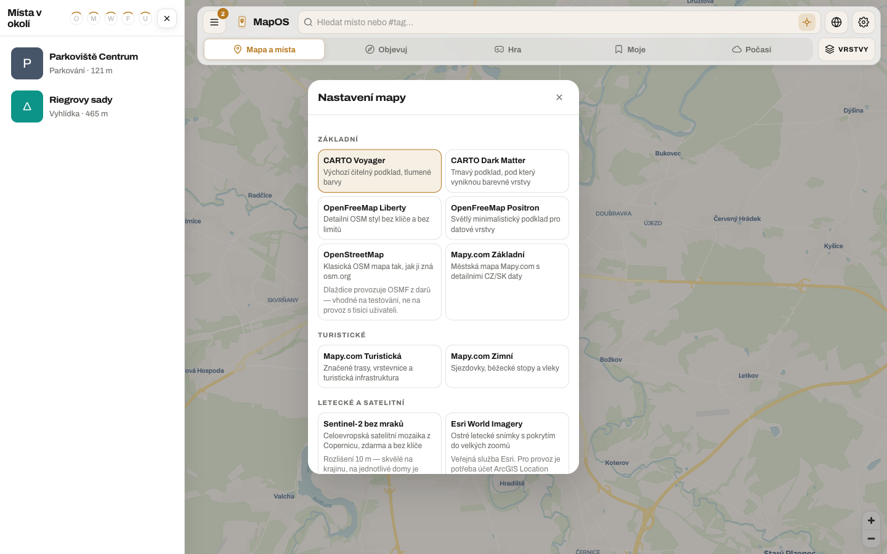
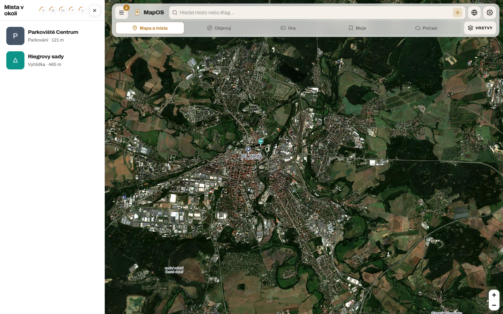

# Podklady map — co je zdarma a kde to sehnat

Podklad (dlaždice pod mapou) je v MapOS oddělený od zdrojů míst. Vybírá se právě jeden, v
**Nastavení mapy** (ikona glóbu v horní liště). Zdroje pinů, počasí, herní vrstva a všechno
ostatní se kreslí nad ním, ať je od kohokoliv — proto jde srovnávat vlastní data nad leteckým
snímkem Mapy.com i nad satelitem od Googlu.

Katalog žije v `packages/layer-sdk/src/basemaps.ts`. Podklady s klíčem se stahují přes
`GET /basemap/:provider/:mapset/:z/:x/:y` (klíč zůstává na serveru); podklady bez klíče si
prohlížeč tahá sám.

|                                                           |                                                             |
| --------------------------------------------------------- | ----------------------------------------------------------- |
|                 |  |
| Nastavení mapy — podklad, popisky, 3D budovy, zdroje pinů | Satelit se štítky z jiného zdroje nad ním                   |

## Funguje hned, bez registrace

Čerstvý klon vykreslí mapu bez jediného účtu. Tyto podklady nepotřebují klíč:

| Podklad                        | Co to je                          | Limity                                               |
| ------------------------------ | --------------------------------- | ---------------------------------------------------- |
| CARTO Voyager / Dark Matter    | Výchozí vektorový styl nad OSM    | Fair use, bez registrace                             |
| OpenFreeMap Liberty / Positron | OSM vektorové dlaždice            | Bez klíče, bez limitu (běží z darů)                  |
| OpenStreetMap                  | Klasická rastrová OSM mapa        | Provozuje OSMF — jen pro vývoj, ne pro produkci      |
| OpenTopoMap                    | Vrstevnice a reliéf               | Fair use, dobrovolnický provoz                       |
| Sentinel-2 bez mraků (EOX)     | Satelitní mozaika Evropy, 10 m/px | CC-BY-4.0, do zoomu ~15                              |
| EOX Terrain Light              | Reliéf bez silnic                 | CC-BY-SA-4.0                                         |
| NASA GIBS (VIIRS)              | Dnešní satelitní snímek planety   | Public domain, nízké rozlišení                       |
| Esri World Imagery             | Ostré letecké snímky              | Veřejná služba Esri; pro provoz si zařiď účet (níže) |

## Kde se zaregistrovat — bez placení

Seřazeno od nejméně otravného. Sloupec „karta" je to podstatné: kde se karta nevyžaduje, nemůže
ti nic naskočit na účet.

| Služba                            | Zdarma měsíčně                                      | Karta při registraci                           | Kde                                                                           | Proměnná                |
| --------------------------------- | --------------------------------------------------- | ---------------------------------------------- | ----------------------------------------------------------------------------- | ----------------------- |
| **MapTiler Cloud**                | 100 000 requestů, 5 000 sessions; satelit i outdoor | Ne                                             | [maptiler.com/cloud](https://www.maptiler.com/cloud/)                         | `MAPTILER_API_KEY`      |
| **Stadia Maps**                   | 200 000 kreditů, nekomerční použití                 | Ne                                             | [stadiamaps.com](https://stadiamaps.com/)                                     | `STADIA_API_KEY`        |
| **Thunderforest**                 | 150 000 dlaždic (Hobby plán)                        | Ne                                             | [thunderforest.com/pricing](https://www.thunderforest.com/pricing/)           | `THUNDERFOREST_API_KEY` |
| **Geoapify**                      | 3 000 kreditů denně                                 | Ne                                             | [geoapify.com](https://www.geoapify.com/)                                     | `GEOAPIFY_API_KEY`      |
| **Mapy.com**                      | Free tarif pro vývoj, 5 mapsetů                     | Ne                                             | [developer.mapy.com](https://developer.mapy.com/)                             | `MAPY_API_KEY`          |
| **TomTom**                        | 50 000 dlaždic denně                                | Ne (u free tarifu)                             | [developer.tomtom.com](https://developer.tomtom.com/)                         | `TOMTOM_API_KEY`        |
| **Esri ArcGIS Location Platform** | 2 000 000 dlaždic                                   | Ne                                             | [location.arcgis.com](https://location.arcgis.com/)                           | zatím jen dokumentačně  |
| **HERE**                          | ~30 000 transakcí (Base Plan)                       | **Ano** — jen ověření, neúčtuje se pod limitem | [platform.here.com](https://platform.here.com/)                               | `HERE_API_KEY`          |
| **Google Map Tiles API**          | 100 000 volání 2D dlaždic                           | **Ano** — nutný billing účet                   | [console.cloud.google.com](https://console.cloud.google.com/) → Map Tiles API | `GOOGLE_MAPS_API_KEY`   |

Poznámky, které stojí za přečtení dřív než po prvním vyúčtování:

- **Google** zrušil v březnu 2025 měsíční kredit 200 USD a nahradil ho volnými voláními po
  jednotlivých SKU. 2D dlaždice mají 100 000 volání zdarma měsíčně, ale projekt musí mít
  zapnutý billing a v konzoli si nastav **denní kvótu**, jinak tě chrání jen dobrá vůle. Logo
  Google a jeho atribuci nesmíš ničím překrýt — proto se při jeho zapnutí nic nepřekresluje přes
  levý dolní roh.
- **HERE** zrušil k 31. 8. 2025 Limited Plan (1 000 requestů denně bez karty). Base Plan kartu
  chce, ale do vyčerpání volného limitu neúčtuje nic.
- **Apple Maps** jde použít jen přes MapKit JS, což vyžaduje placený Apple Developer Program
  (99 USD/rok) a nedává rastrové dlaždice do cizího rendereru. Proto v katalogu není.
- **Bing Maps** skončil; nástupcem je Azure Maps s vlastním free tierem, ale s registrací přes
  Azure předplatné (karta).

## Národní ortofoto zdarma

Pro Evropu bývají nejostřejší snímky od národních geoportálů, obvykle bez klíče a bez limitu.
Zatím nejsou v katalogu, protože každý má jiné pokrytí; přidání je jeden záznam v `BASEMAPS`:

| Země           | Služba                                           | Poznámka                          |
| -------------- | ------------------------------------------------ | --------------------------------- |
| Česko          | [ČÚZK WMTS ortofoto](https://ags.cuzk.cz/)       | Bez klíče, aktualizace po krajích |
| Rakousko       | [basemap.at](https://basemap.at/)                | Ortofoto i mapa, bez klíče        |
| Nizozemsko     | [PDOK](https://www.pdok.nl/)                     | Luchtfoto, bez klíče              |
| Francie        | [Géoplateforme IGN](https://geoservices.ign.fr/) | Od 2024 zdarma bez klíče          |
| Švýcarsko      | [swisstopo](https://www.swisstopo.admin.ch/)     | Bez klíče pro nekomerční          |
| Velká Británie | [OS Data Hub](https://osdatahub.os.uk/)          | Free plán, vyžaduje účet          |

## Co licence chtějí

Atribuce se počítá z toho, co je zrovna na obrazovce (`apps/web/src/layers/attribution.ts`),
takže nový podklad se sám objeví v kreditech pod mapou i v seznamu v **Nastavení → O aplikaci**.
Dvě věci to nezachytí a musíš na ně myslet ručně:

- **Mapy.com** vyžadují viditelné logo, dokud jsou jejich dlaždice na mapě. Řeší to
  `MapyLogoControl`, který se přidává i tehdy, když je od nich jen vrstva popisků.
- **Google** zakazuje překrývat své logo a atribuci cizími prvky.

## Přidání dalšího podkladu

1. Záznam do `BASEMAPS` v `packages/layer-sdk/src/basemaps.ts` — `tiles` pro veřejný zdroj,
   `proxy` pro takový, co chce klíč.
2. U klíčovaného zdroje navíc provider v `apps/api/src/services/basemapService.ts` a klíč
   v `config.tileKeys`. Capability flag vznikne sám podle názvu klíče.
3. Atribuce patří do záznamu, ne do UI.

Nic dalšího není potřeba: výběr v Nastavení mapy, atribuce, přepínání témat i skrytí podkladu
bez klíče jdou z katalogu.
