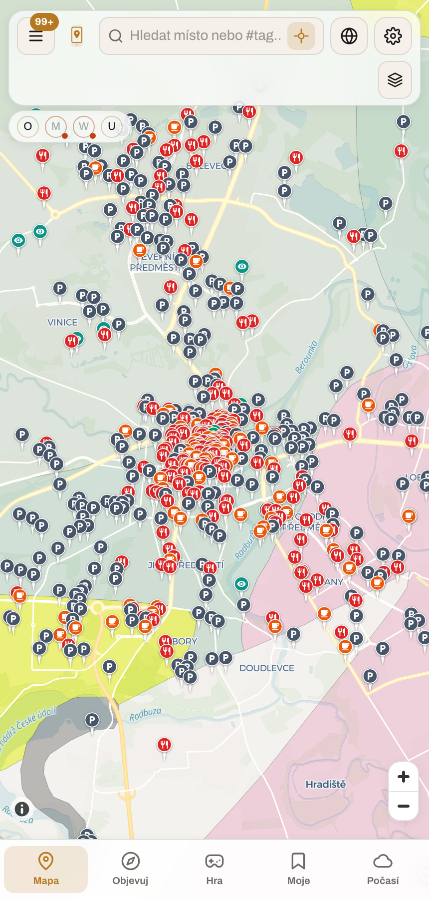
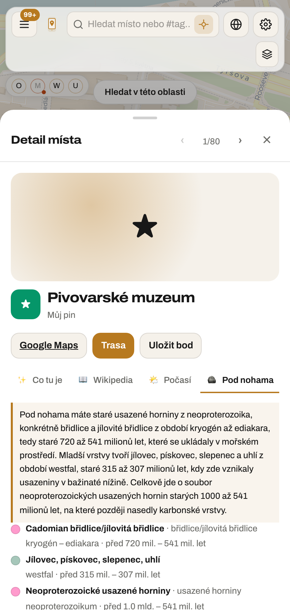
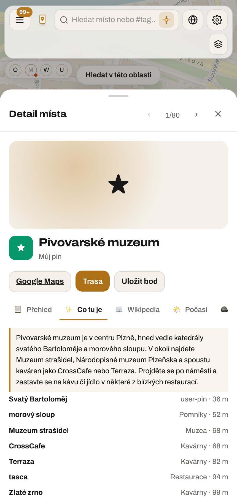

# Data sources

Every layer, place source and info panel in MapOS comes from a public source. This is the list:
what it gives you, what it costs, and what its licence asks of you in return.

Nothing here is required. A fresh clone runs with no keys at all and still gets a basemap, POIs,
weather, six tile overlays, seven data layers, geocaching-style quests and Wikivoyage guides.
Keys only ever add things.

## Where to register

All of these are free and take a few minutes. Put the key in `.env` (see `.env.example`); the
layer appears as soon as the server restarts, and stays hidden until then — a layer gated behind
a key the deployment doesn't hold is not offered at all, which is kinder than a toggle that can
only produce an error.

| Layer / feature          | Sign up at                                        | Env var                  | Notes                                                                                                      |
| ------------------------ | ------------------------------------------------- | ------------------------ | ---------------------------------------------------------------------------------------------------------- |
| EV charging stations     | https://openchargemap.org/site/develop/api        | `OPENCHARGEMAP_API_KEY`  | Instant key, generous limits                                                                               |
| Street imagery           | https://www.mapillary.com/dashboard/developers    | `MAPILLARY_ACCESS_TOKEN` | Create an app, copy the client token                                                                       |
| Live ships (worldwide)   | https://aisstream.io/account                      | `AISSTREAM_API_KEY`      | WebSocket stream; server-side only, 3 connections per account                                              |
| Active fires             | https://firms.modaps.eosdis.nasa.gov/api/map_key/ | `NASA_FIRMS_MAP_KEY`     | Emailed MAP_KEY; 5000 transactions per 10 min                                                              |
| Air quality stations     | https://explore.openaq.org/register               | `OPENAQ_API_KEY`         | v3 requires the key in an `X-API-Key` header                                                               |
| Bird sightings           | https://ebird.org/api/keygen                      | `EBIRD_API_TOKEN`        | Needs a (free) eBird account first                                                                         |
| Events + timeline        | https://developer.ticketmaster.com/               | `TICKETMASTER_API_KEY`   | 5000 calls/day; European coverage is uneven                                                                |
| Geocaching quests        | https://www.opencaching.de/okapi/signup.html      | `OKAPI_KEY_DE` and peers | One key per national instance (DE, PL, NL, UK, US)                                                         |
| Notability ranking       | https://opentripmap.io/product                    | `OPENTRIPMAP_API_KEY`    | Only improves ordering in Objevuj; ranking works without it                                                |
| Basemap, routing, POI    | https://developer.mapy.com                        | `MAPY_API_KEY`           | Optional alternative provider; 250k credits/month free                                                     |
| Place photos and ratings | https://location.foursquare.com/developer/        | `FSQ_API_KEY`            | Enriches a single place on demand, not bulk search                                                         |
| Weather tile overlays    | https://openweathermap.org/api                    | `OWM_API_KEY`            | Only the tile layers; forecasts come from Open-Meteo, keyless                                              |
| Animated weather tiles   | https://cloud.maptiler.com                        | `MAPTILER_API_KEY`       | MapTiler Weather: radar, wind, temperature, precipitation, pressure (72 h); also unlocks MapTiler basemaps |
| Prague open data         | https://api.golemio.cz/api-keys                   | `GOLEMIO_API_KEY`        | Golemio v2: gardens, playgrounds, libraries, health, police, air, cycling, waste yards; Prague bbox only   |
| Cultural heritage        | https://pro.europeana.eu/page/get-api             | `EUROPEANA_API_KEY`      | Search API `wskey`; a personal key is enough for the point layer                                           |
| Place summaries (CML)    | https://platform.openai.com / https://ollama.com  | `OPENAI_API_KEY`         | Paid, or `OLLAMA_API_KEY` for the free tier                                                                |

`MAPOS_CONTACT` is not a key but set it anyway on anything public: Nominatim, Overpass and the
Wikimedia APIs require a `User-Agent` that identifies the deployment, and without one your
traffic shares a rate-limit bucket with every other MapOS clone.

## Keyless sources

These need no registration and are always on.

| Source               | Used for                                                                                        | Licence                       |
| -------------------- | ----------------------------------------------------------------------------------------------- | ----------------------------- |
| OpenStreetMap        | POIs via Overpass, basemap data                                                                 | ODbL 1.0                      |
| Nominatim            | Geocoding and reverse geocoding                                                                 | ODbL 1.0                      |
| OSRM                 | Route planning (public demo server)                                                             | ODbL 1.0                      |
| CARTO basemaps       | Default light/dark vector tiles                                                                 | Free tier, no key             |
| CyclOSM              | Cycling basemap                                                                                 | ODbL / CC-BY-SA               |
| OpenFreeMap Dark     | Dark keyless vector basemap                                                                     | OpenMapTiles                  |
| OSM France           | French community OSM basemap                                                                    | CC-BY-SA 2.0                  |
| ÖPNV-Karte           | Public-transport basemap                                                                        | CC-BY-SA 2.0                  |
| OSM Humanitarian     | High-contrast basemap for field mapping                                                         | CC-BY-SA 2.0                  |
| Eurostat GISCO       | NUTS + LAU boundaries for Discover regions                                                      | Eurostat reuse                |
| Waymarked Trails     | Hiking, cycling, MTB, piste routes                                                              | CC-BY-SA 3.0                  |
| OpenRailwayMap       | Railway overlay                                                                                 | CC-BY-SA 2.0                  |
| OpenSeaMap           | Nautical marks                                                                                  | ODbL 1.0                      |
| OpenTopoMap          | Contours and hillshade                                                                          | CC-BY-SA 3.0                  |
| OpenSnowMap          | Pistes and cross-country trails                                                                 | CC-BY-SA 2.0                  |
| USGS                 | Earthquakes                                                                                     | Public domain                 |
| iNaturalist          | Species observations with photos                                                                | CC-BY-NC (varies)             |
| GBIF                 | Biodiversity occurrence records                                                                 | CC-BY 4.0                     |
| Sensor.Community     | Citizen air-quality sensors                                                                     | ODbL 1.0                      |
| Wikimedia Commons    | Geolocated photos                                                                               | CC / public domain            |
| Refuge Restrooms     | Accessible and gender-neutral toilets                                                           | Open data                     |
| GBFS operator feeds  | Bike and scooter sharing stations                                                               | Per operator                  |
| RainViewer           | Weather radar                                                                                   | Free tier                     |
| Open-Meteo           | Wind grid, forecasts, info panel                                                                | CC-BY 4.0                     |
| Wikipedia / Wikidata | Articles, QIDs, place metadata, ranking                                                         | CC-BY-SA / CC0                |
| Wikivoyage           | Objevuj guide content                                                                           | CC-BY-SA 4.0                  |
| Wiki Loves Monuments | Quests: monuments still missing a photo                                                         | CC-BY-SA / CC0                |
| OSM Notes            | Quests: open map problems to verify                                                             | ODbL 1.0                      |
| Turf Game            | Quests: existing takeover zones                                                                 | Public API                    |
| Macrostrat           | Geology overlay and the "Pod nohama" panel                                                      | CC-BY 4.0                     |
| OpenInfraMap         | Power, telecoms, gas/oil and water grids                                                        | ODbL 1.0 / CC-BY 4.0          |
| Tilezen Terrain      | 3D terrain and hillshade (Terrarium DEM)                                                        | Per source dataset            |
| EEA Natura 2000      | Protected areas across the EU                                                                   | EEA re-use policy             |
| Eurostat GISCO       | NUTS 0–3 and LAU boundaries for `geo_units`                                                     | CC BY 4.0 (© EuroGeographics) |
| Natural Earth        | World country boundaries for `geo_units`                                                        | Public domain                 |
| geoBoundaries        | Sub-national ADM1/ADM2 outside Europe                                                           | CC BY 4.0 / ODbL              |
| OSM bitcoin tags     | Bitcoin ATMs and merchants (`currency:XBT`, `payment:bitcoin`; the tagging BTC Map is built on) | ODbL 1.0                      |
| MeshCore Analyzer    | Community LoRa mesh nodes (meshcore.cz)                                                         | Community data                |
| NASA GIBS            | VIIRS Black Marble night lights (sky darkness)                                                  | NASA open data                |

## What the licences ask for

Attribution is not optional for most of these. Each layer plugin and place source declares its
`attribution`, and the map's attribution control shows the credits for whatever is currently
switched on (`apps/web/src/layers/attribution.ts`) — so adding a source without filling that
field in is a licensing bug, not a cosmetic one. The full list, on or off, is in
Settings → O aplikaci.

Mapy.com has the one hard display condition beyond a credit string: whenever its tiles are
shown, the Mapy logo control must be visible. `MapCore` binds that control's lifetime to the
provider rather than to the map style so it cannot drift out of sync.

ODbL in particular (OpenStreetMap and everything derived from it) requires that derived
databases stay open. Displaying the data is fine; redistributing a modified extract means
publishing it under ODbL too.

iNaturalist observations are per-observer licensed and many are non-commercial. Treat the layer
as "look, don't rebuild a product on top of it".

OpenInfraMap is one person's project (Russss) with no published usage policy, unlike the OSMF
services above. The layer therefore asks for tiles only from z7 up: below that a continent's
worth of lines is unreadable anyway, so not requesting them costs nothing and is the polite
reading of a service that has not told us what it can carry. The data is OSM's under ODbL; the
CC-BY 4.0 applies to the project's own cartography and analysis, and since OpenInfraMap ships no
style, MapOS draws the networks with its own — which is why its legend can state the voltage
scale exactly.

Tilezen's terrain tiles are an aggregate: SRTM, ESA and USGS data among others, each under its
own terms, which is why the table says "per source dataset" rather than naming one licence. The
credit line names the aggregate and the main contributors. Heights are `terrarium`-encoded
(`(R * 256 + G + B / 256) - 32768` metres); reading them as MapLibre's default Mapbox encoding
yields wrong elevations rather than an error, so the source declares the encoding explicitly.

Natura 2000 comes from the EEA as WMS rather than tiles, which needs no adapter: MapLibre's
raster source substitutes the tile extent into `{bbox-epsg-3857}`, so one GetMap per tile is just
a URL template. Two details are load-bearing. The placeholder must stay unencoded, or the literal
braces are sent and the service answers with an empty image rather than an error — a layer that
looks on and draws nothing. And the service publishes three layers, of which the combined one
(`0`) is a flat magenta fill; the per-directive layers (`1`, `2`) draw outlines with hatching, so
those are the ones used and the ground stays readable underneath.

Boundaries are the one class of source imported rather than fetched per viewport. A NUTS
edition changes every three years, so `npm run geo:units -w @mapos/api` writes `geo_units` once
and every thematic overlay joins against it — Eurostat's crime series and its population series
then share a single copy of each polygon.

### Seeding themes in a fresh checkout

The Themes section is empty until both imports have run, because a theme is a join and half a
join draws nothing. Against a Postgres/PostGIS database:

```sh
npm run geo:units -w @mapos/api     # boundaries: GISCO NUTS + geoBoundaries ADM1
npm run stats:import -w @mapos/api  # series: Eurostat and World Bank
```

Neither needs an API key: Eurostat, GISCO and the World Bank are open endpoints, and the
importers are the only place that talks to them. Order matters only in that a series with no
boundary to join onto is stored and simply never drawn, so re-running `stats:import` after
`geo:units` fixes a half-seeded database without a reset. The offline memory server needs
neither command — it serves fixture territories, which is why the audit screenshots have data
in them without a database.

Which generalisation gets imported is a licensing-adjacent decision worth stating: GISCO
publishes NUTS at 1M through 60M, and the catalogue asks for 10M. A continental choropleth
cannot show 1M coastline, the file is tens of megabytes, and the guarded fetch caps a response
at 16 MiB — so the coarse edition is both the honest choice and the only importable one. Detail
at a country zoom is meant to come from a national source with a finer `geoLevel`, not from more
coastline on the same polygon.

geoBoundaries is fetched per country rather than as the combined ADM1 file, for the same reason,
through its metadata endpoint: that is where the simplified download URL for a country lives.
EuroGeographics requires its copyright line on anything drawn from GISCO boundaries, so the
attribution travels with the row (`geo_units.source_id`) and not just with the importer.

Because the EEA ships the cartography, MapOS does not restyle it — the legend instead quotes the
service's own swatches, read off its `GetLegendGraphic` rather than sampled from a rendered tile,
where antialiasing would have given a colour that is in no key. Coverage stops at the union
border, so the legend says so: an empty map over Serbia is the dataset's limit, not a fault.

## Geology, and what a model is for

Macrostrat stitches national geological surveys into one global set of vector tiles plus a point
API, keyless and CC BY. The tiles carry the colour each survey assigned its own units, so the
overlay reads `["get", "color"]` and looks like a geological map because it is one.

The point API answers with things like `Cadomian shale/slate, Ediacaran–Cryogenian, 541–720 Ma`.
That is correct and useless to almost everyone, which is what the "Pod nohama" panel is for. Two
rules came out of building it, and they generalise to any AI feature here:

- **Closed vocabularies are translated in code, not by the model.** Period names and lithology
  terms are a few dozen strings each. Left to the model, "Cadomian" next to "Cryogenian" became
  _kambrium_, and "shale/slate" became _břidlice a svátky_ — slate read as a word about holidays.
  Both are wrong in a way a reader cannot catch. They are lookup tables now
  (`apps/api/src/services/geologyService.ts`), and the model gets Czech input.
- **Say where you are.** Handed only a name, a model writes about the place of that name it
  happens to know: asked about Riegrovy sady in Plzeň it described the Prague park, Vinohrady and
  Žižkov included. Briefs carry the municipality from Nominatim and an instruction not to argue
  with it.

Where a survey writes in German or French, the same call translates — that part genuinely needs a
model, and it is the part left to one.

|                                               |                                          |                                      |
| --------------------------------------------- | ---------------------------------------- | ------------------------------------ |
|  |    |    |
| Barrandien nad Prahou, barvy přímo z dlaždice | Vysvětlení nad jednotkami, ne místo nich | Souhrn s podklady, ze kterých vznikl |

## AI summaries (CML)

`apps/api/src/services/cmlService.ts` is the only module that talks to a language model. Provider
is `CML_PROVIDER`: `ollama` (Ollama Cloud, OpenAI-compatible) or `openai`. Three guarantees
callers rely on:

- **It never throws.** No key, a slow model, a retired model — all return `null`, and the caller
  shows what it would have shown before generation existed.
- **Identical prompts are answered from memory**, so a re-mounted tab costs nothing.
- **Reasoning models are handled.** DeepSeek v4 and gpt-oss spend two to three thousand tokens
  thinking before they answer, and put that in a separate `reasoning` field. A budget sized for
  the visible answer comes back truncated or empty, so `max_tokens` defaults to 2000 and a reply
  that hit the ceiling is discarded rather than cached.

Ollama Cloud retires models on a few months' notice, and a retired one answers `410` on every
call — which is how `deepseek-v3.1:671b` silently stopped working here. Ask what is live:

```bash
curl -H "Authorization: Bearer $OLLAMA_API_KEY" https://ollama.com/v1/models
```

Where generation appears today: the geology panel, the "Co tu je" brief in place detail, and the
region summaries in Objevuj. Every one of them shows its sources next to the generated text, and
every one still renders with the model switched off.

## Park4Night

Their API works, and the integration did not: the endpoint wraps its places in
`{"lieux": [...]}` and the parser only accepted a bare array, so the layer had been returning
zero features. Fixed — along with the place codes (`PN`, `PJ`, `DS`, `AR`, `ACC_*` were all
falling into "other") and the cell size, which at zoom 8 asked once at the centre of a cell five
times wider than the ~20 km the answer covers, then marked the whole cell fetched.

The upstream response also says:

> `"api_infos": "This data is not public, STOP your parsing Thank you"`

[Park4Night GTCU article 5](https://plus.park4night.com/en/cgu) is preserved in the advisory source
record as `PARK4NIGHT-GTCU-ARTICLE-5-PRIOR-AUTHORIZATION-REQUIRED`. Per ADR 0012 that record does
not hide data or block the prototype. `PARK4NIGHT_ENABLED=1` is the sole runtime switch; the adapter
still enforces pacing, bounded responses, timeouts, a seven-day cell cache and graceful failure.
The **Karavany a kempy** layer remains an independent technical fallback using
`tourism=caravan_site`, `tourism=camp_site`, `amenity=sanitary_dump_station`, drinking water,
toilets, showers and parking from the ordinary OSM POI pipeline.

## Considered and rejected

Worth recording, so nobody spends an afternoon rediscovering these. The common thread: a fork
inherits the code but not the contract, so anything requiring a signed agreement or bespoke
branding is a bad default even when the data is good.

- **Geocaching.com** — no public API; the partner programme is a waiting list that explicitly
  rejects hobby projects, and imposes branding and feature limits. Opencaching's OKAPI is the
  open alternative and is what the game layer uses.
- **TripAdvisor (Terra)** — 1,000 calls/month free, then paid; signed master terms plus mandatory
  branding (their logo, their exact rating graphics and hex colours) that every fork would ship
  without having agreed to it.
- **Google Places** — usable only on a Google map, which rules it out for a MapLibre app.
- **Yelp Fusion** — thin European coverage; not worth the integration.
- **Munzee** — partner-only API.
- **Ingress / Pokémon GO** — no legal API. Portal and stop locations are scraped data.
- **Strava** — requires a subscription and caps athlete count as of 2026.
- **Komoot / Trailforks / theCrag** — B2B agreements or case-by-case approval only.
- **BikeMaps.org** — a REST API exists (`/incidents.json`, `in_bbox` filtering) but the public
  instance times out or returns 502. Revisit if the service becomes reliable.
- **Overture Maps** — excellent data, but distributed as Parquet for bulk download rather than a
  queryable API. It needs a local import step, which is why the POI source reports itself as
  unavailable rather than pretending to work.

## Checklist for a new source

1. Does the licence permit use in an Apache-2.0 project that anyone can fork and self-host?
2. Does it require branding, a signed agreement, or per-deployment approval? If yes, it belongs
   behind a capability flag at most — never as a default.
3. What attribution string must be displayed? Put it in the plugin's `attribution` field, with
   `url` and `license`, so the map control and the About list pick it up on their own.
4. Does the free tier survive a map that refetches on viewport change? If not, mark the layer
   `viewportCost: "expensive"` so it only loads on explicit request.
5. Add a row to the tables above, and a sign-up line to `.env.example` if it needs a key.

See [CONTRIBUTING.md](../CONTRIBUTING.md) for the code side of each extension point: layers,
POI sources, info panels, quest sources and guide sources.
